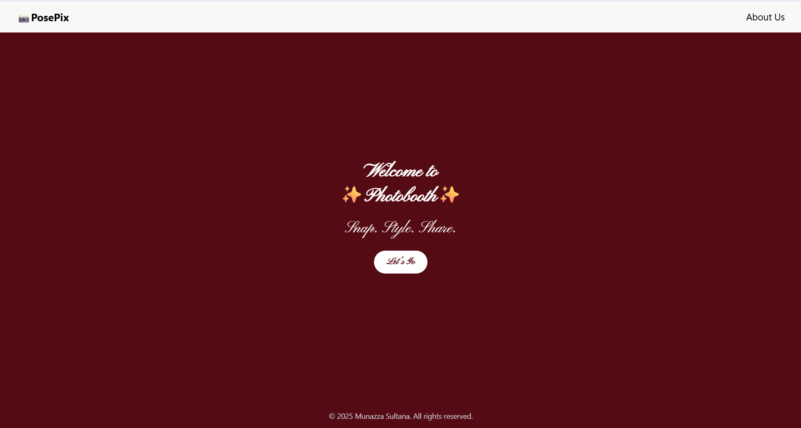
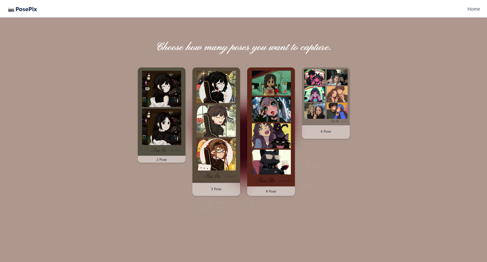
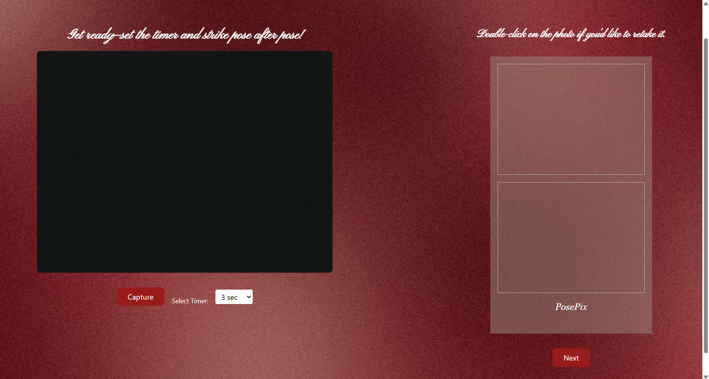
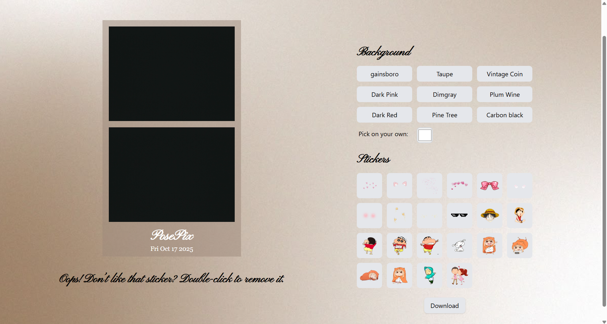
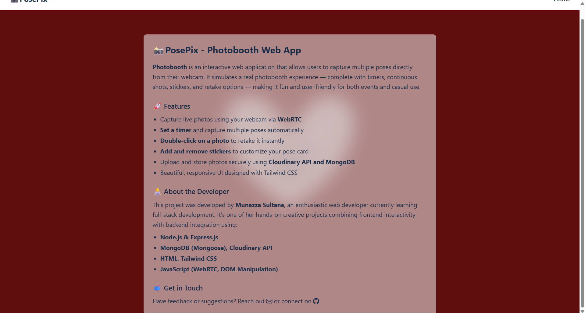

# 📸 PosePix - AI Photo Booth App

PosePix is a web-based photo booth application that lets users **capture photos directly from the browser**, apply **stickers or poses**, and **download or save** the final image.  
It supports **mobile and desktop usage** with backend integration for **Cloudinary uploads and MongoDB storage**.

## 🚀 Features

- 📸 **Capture Photos:** Take pictures directly from your webcam or mobile camera.
- 🔁 **Retake Option:** Instantly retake your photo if you’re not satisfied — no need to refresh the page.
- 🎨 **Custom Background Colours:** Choose from pre-set colours or pick your own custom colour.
- 💖 **Stickers:** Add fun stickers to personalise your pose card.
- 🖐️ **Drag & Drop Stickers:** Move stickers freely on your pose card for creative placement.
- 🗑️ **Remove Stickers:** Double-click on any sticker to remove it.
- 💾 **Download Pose Card:** Save your final pose card as a PDF.
- ☁️ **Upload Captured Photos to Cloudinary**  
- 🧠 **MongoDB Integration** for image data storage

  ## 🧰 Tech Stack

| Layer | Technologies |
|-------|---------------|
| Frontend | HTML, CSS, JavaScript (WebRTC, Canvas API) |
| Backend | Node.js, Express.js |
| Database | MongoDB (via Mongoose) |
| Cloud Storage | Cloudinary |
| Tools | Multer (for file upload), CORS, Dotenv |  

## 📸 Screenshot

### 📌 Home Page


### 📌 Layout Page


### 📌 Camera Page


### 📌 Editing Page


### 📌 About Page


## ⚙️ Installation & Setup
1. Clone the repository
```bash
git clone https://github.com/Munazz-a/posepix.git
cd posepix
npm install

Create a .env file in your project root and add:
PORT=3000
MONGO_URI=your_mongodb_connection_string
CLOUDINARY_CLOUD_NAME=your_cloud_name
CLOUDINARY_API_KEY=your_api_key
CLOUDINARY_API_SECRET=your_api_secret

node index.js
```
🧑‍💻 Contributors

**Munazza Sultana**
Developer, Designer, and Backend Integrator.

🪪 License

This project is licensed under the MIT License.
